# Program-Mahasiswa
## Tugas Program
### Data Mahasiswa

Program kali ini saya menggunakan, Dictionary dengan tampilan menu pilihan: (Tambah data, Ubah data, Hapus data, Tampilan data, Cari data) Nilai Akhir diambil dari perhitungan 3 komponen nilai (tugas: 30%,uts: 35%, uas: 35%)'
'

1. Tampilan coding di pycram'
'
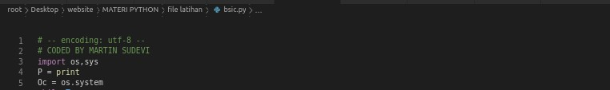
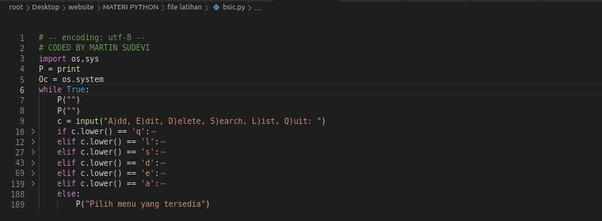
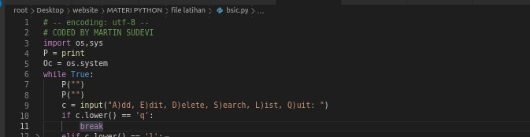
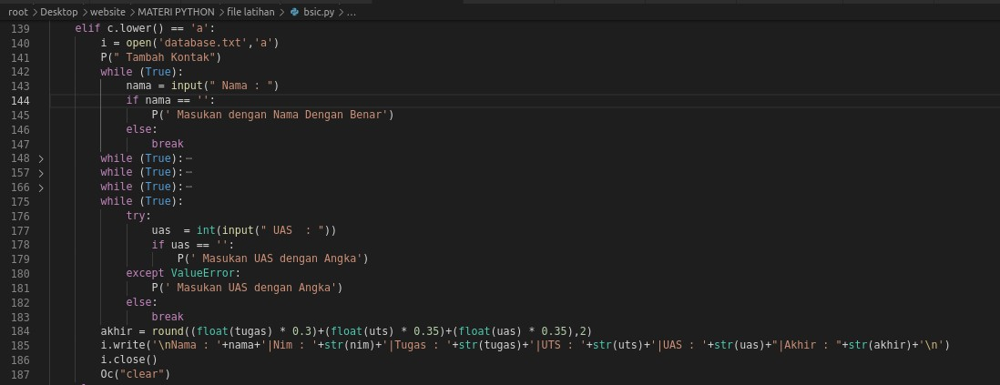
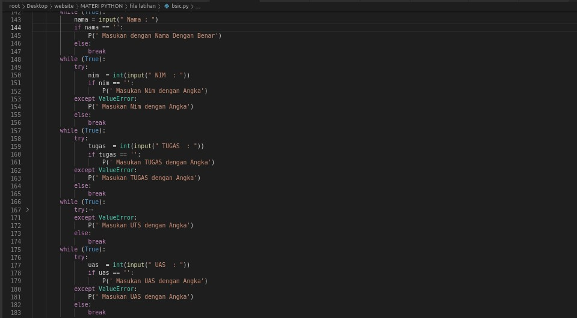
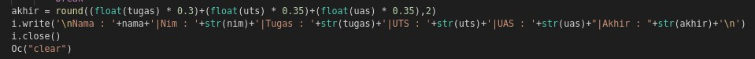
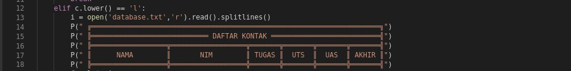

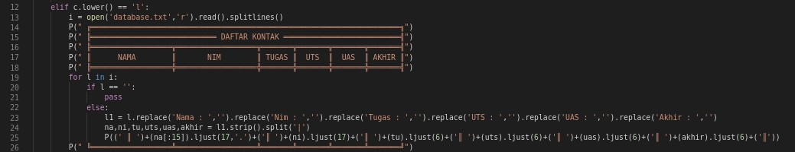

2. Tampilan Run Di Pycram'
'
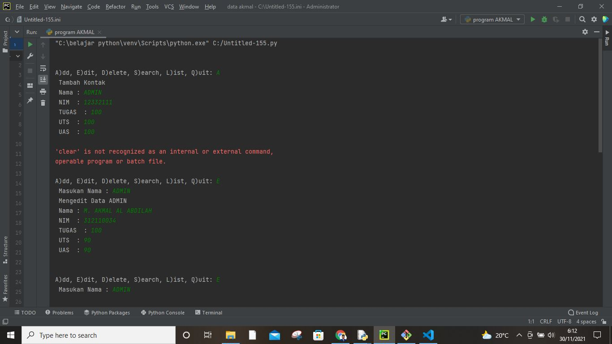
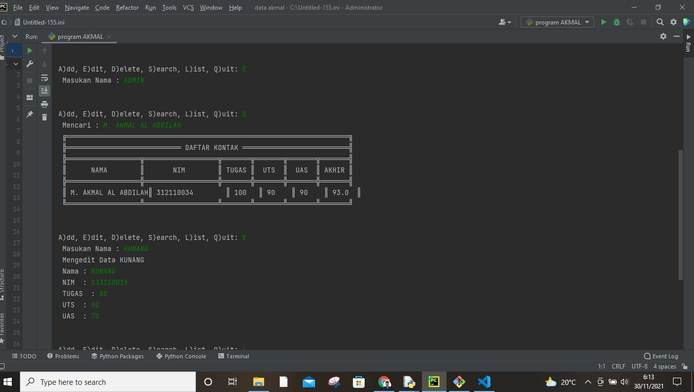
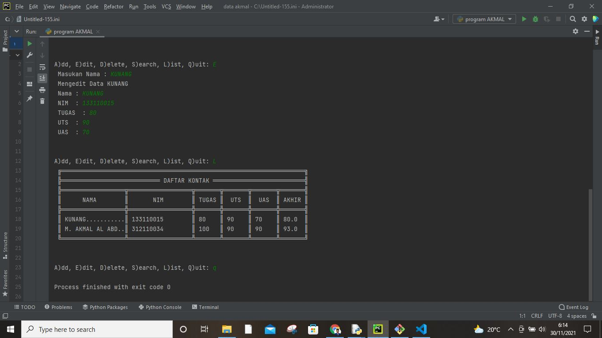

3. Tampilan Scerip Coding Pythonnya'
'
 -- encoding: utf-8 --
 CODED BY MARTIN SUDEVI
import os,sys
P = print
Oc = os.system
while True:
    P("")
    P("")
    c = input("A)dd, E)dit, D)elete, S)earch, L)ist, Q)uit: ")
    if c.lower() == 'q':
        break
    elif c.lower() == 'l':
        i = open('database.txt','r').read().splitlines()
        P(" ╔═════════════════════════════════════════════════════════════════════╗")
        P(" ╠════════════════════════════ DAFTAR KONTAK ══════════════════════════╣")
        P(" ╠══════════════════╦══════════════════╦═══════╦═══════╦═══════╦═══════╣")
        P(" ║      NAMA        ║       NIM        ║ TUGAS ║  UTS  ║  UAS  ║ AKHIR ║")        
        P(" ╠══════════════════╬══════════════════╬═══════╬═══════╬═══════╬═══════╣")
        for l in i:
            if l == '':
                pass
            else:
                l1 = l.replace('Nama : ','').replace('Nim : ','').replace('Tugas : ','').replace('UTS : ','').replace('UAS : ','').replace('Akhir : ','')
                na,ni,tu,uts,uas,akhir = l1.strip().split('|')
                P((' ║ ')+(na[:15]).ljust(17,'.')+('║ ')+(ni).ljust(17)+('║ ')+(tu).ljust(6)+('║ ')+(uts).ljust(6)+('║ ')+(uas).ljust(6)+('║ ')+(akhir).ljust(6)+('║'))
        P(" ╚══════════════════╩══════════════════╩═══════╩═══════╩═══════╩═══════╝")
    elif c.lower() == 's':
        cari = input(' Mencari : ')
        i = open('database.txt','r').read().splitlines()
        P(" ╔═════════════════════════════════════════════════════════════════════╗")
        P(" ╠════════════════════════════ DAFTAR KONTAK ══════════════════════════╣")
        P(" ╠══════════════════╦══════════════════╦═══════╦═══════╦═══════╦═══════╣")
        P(" ║      NAMA        ║       NIM        ║ TUGAS ║  UTS  ║  UAS  ║ AKHIR ║")        
        P(" ╠══════════════════╬══════════════════╬═══════╬═══════╬═══════╬═══════╣")
        for l in i:
            if l == '':
                pass
            elif cari in l:
                l1 = l.replace('Nama : ','').replace('Nim : ','').replace('Tugas : ','').replace('UTS : ','').replace('UAS : ','').replace('Akhir : ','')
                na,ni,tu,uts,uas,akhir = l1.strip().split('|')
                P((' ║ ')+(na).ljust(17)+('║ ')+(ni).ljust(17)+('║ ')+(tu).ljust(6)+('║ ')+(uts).ljust(6)+('║ ')+(uas).ljust(6)+('║ ')+(akhir).ljust(6)+('║'))
        P(" ╚══════════════════╩══════════════════╩═══════╩═══════╩═══════╩═══════╝")
    elif c.lower() == 'd':
        u = open('database.txt','r').read().splitlines()
        target = input(' Masukan Nama : ')
        nm = []
        for l in u:
            if l == '':
                pass
            else:
                l1 = l.replace('Nama : ','').replace('Nim : ','').replace('Tugas : ','').replace('UTS : ','').replace('UAS : ','').replace('Akhir : ','')
                na,ni,tu,uts,uas,akhir = l1.strip().split('|')
                if str(na) == str(target):
                    P('BERHASIL MENGHAPUS Data %s'%(target))
                    pass
                else:      
                    nm.append(str(l)+'\n')
        new = open('database.txt','w')        
        new.write(str(nm))
        new.close()
        new = open('database.txt','r').read().splitlines()
        new1 = open('database.txt','w')
        new1.close()
        new2 = open('database.txt','a')
        for i in new:
            i2 = i.replace("['","").replace("\\n', '", "\n").replace("']","").replace("\\n",'')
            new2.write(i2)
        new2.close()
    elif c.lower() == 'e':
        u = open('database.txt','r').read().splitlines()
        target = input(' Masukan Nama : ')
        nm = []
        for l in u:
            if l == '':
                pass
            else:
                l1 = l.replace('Nama : ','').replace('Nim : ','').replace('Tugas : ','').replace('UTS : ','').replace('UAS : ','').replace('Akhir : ','')
                na,ni,tu,uts,uas,akhir = l1.strip().split('|')
                if na == target:
                    P(' Mengedit Data %s'%(target))
                    while (True):
                        nama = input(" Nama : ")
                        if nama == '':
                            P(' Masukan dengan Nama Dengan Benar')
                        else:
                            break
                    while (True):
                        try:
                            nim  = int(input(" NIM  : "))
                            if nim == '':
                                P(' Masukan Nim dengan Angka')
                        except ValueError:
                            P(' Masukan Nim dengan Angka')                
                        else:
                            break
                    while (True):
                        try:
                            tugas  = int(input(" TUGAS  : "))
                            if tugas == '':
                                P(' Masukan TUGAS dengan Angka')
                        except ValueError:
                            P(' Masukan TUGAS dengan Angka')                
                        else:
                            break
                    while (True):
                        try:
                            uts  = int(input(" UTS  : "))
                            if uts == '':
                                P(' Masukan UTS dengan Angka')
                        except ValueError:
                            P(' Masukan UTS dengan Angka')                
                        else:
                            break
                    while (True):
                        try:
                            uas  = int(input(" UAS  : "))
                            if uas == '':
                                P(' Masukan UAS dengan Angka')
                        except ValueError:
                            P(' Masukan UAS dengan Angka')                
                        else:
                            break
                    akhir = round((float(tugas) * 0.3)+(float(uts) * 0.35)+(float(uas) * 0.35),2)
                    edit  =('Nama : '+nama+'|Nim : '+str(nim)+'|Tugas : '+str(tugas)+'|UTS : '+str(uts)+'|UAS : '+str(uas)+"|Akhir : "+str(akhir)+'\n')
                    nm.append(edit+'\n')
                else:      
                    nm.append(str(l)+'\n')
        new = open('database.txt','w')        
        new.write(str(nm))
        new.close()
        new = open('database.txt','r').read().splitlines()
        new1 = open('database.txt','w')
        new1.close()
        new2 = open('database.txt','a')
        for i in new:
            i2 = i.replace("['","").replace("\\n', '", "\n").replace("']","").replace("\\n","\n")
            new2.write(i2+'\n')
        new2.close()
    elif c.lower() == 'a':
        i = open('database.txt','a')
        P(" Tambah Kontak")
        while (True):
            nama = input(" Nama : ")
            if nama == '':
                P(' Masukan dengan Nama Dengan Benar')
            else:
                break
        while (True):
            try:
                nim  = int(input(" NIM  : "))
                if nim == '':
                    P(' Masukan Nim dengan Angka')
            except ValueError:
                P(' Masukan Nim dengan Angka')                
            else:
                break
        while (True):
            try:
                tugas  = int(input(" TUGAS  : "))
                if tugas == '':
                    P(' Masukan TUGAS dengan Angka')
            except ValueError:
                P(' Masukan TUGAS dengan Angka')                
            else:
                break
        while (True):
            try:
                uts  = int(input(" UTS  : "))
                if uts == '':
                    P(' Masukan UTS dengan Angka')
            except ValueError:
                P(' Masukan UTS dengan Angka')                
            else:
                break
        while (True):
            try:
                uas  = int(input(" UAS  : "))
                if uas == '':
                    P(' Masukan UAS dengan Angka')
            except ValueError:
                P(' Masukan UAS dengan Angka')                
            else:
                break
        akhir = round((float(tugas) * 0.3)+(float(uts) * 0.35)+(float(uas) * 0.35),2)
        i.write('\nNama : '+nama+'|Nim : '+str(nim)+'|Tugas : '+str(tugas)+'|UTS : '+str(uts)+'|UAS : '+str(uas)+"|Akhir : "+str(akhir)+'\n')
        i.close()
        Oc("clear")
    else:
        P("Pilih menu yang tersedia")'
'

4. Flowchartnnya'
'
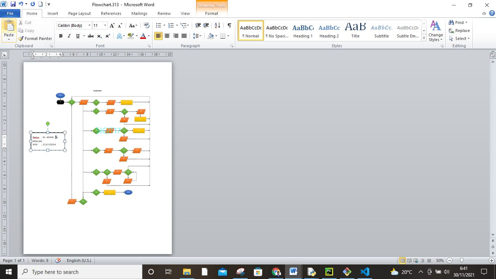

5. SOAL LATIHAN PERTEMUAN 10 '
'
Buat Dictionary daftar kontak
• Tampilkan kontaknya Ari
• Tambah kontak baru dengan nama Riko, nomor 087654544
• Ubah kontak Dina dengan nomor baru 088999776
• Tampilkan semua Nama
• Tampilkan semua Nomor
• Tampilkan daftar Nama dan nomornya
• Hapus kontak Dina.'
'
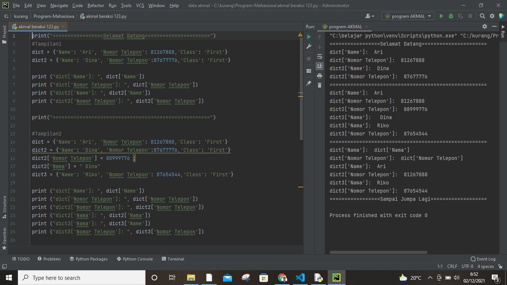
Scrip coding Pythonnya:'
'
print("=================Selamat Datang======================")
#Tampilan1
dict = {'Name': 'Ari', 'Nomor Telepon': 81267888,'Class': 'First'}
dict2 = {'Name': 'Dina', 'Nomor Telepon':87677776,'Class': 'First'}

print ("dict['Name']: ", dict['Name'])
print ("dict['Nomor Telepon']: ", dict['Nomor Telepon'])
print ("dict2['Name']: ", dict2['Name'])
print ("dict2['Nomor Telepon']: ", dict2['Nomor Telepon'])

print("=====================================================")

#Tampilan2
dict = {'Name': 'Ari', 'Nomor Telepon': 81267888,'Class': 'First'}
dict2 = {'Name': 'Dina', 'Nomor Telepon':87677776,'Class': 'First'}
dict2['Nomor Telepon'] = 88999776 ; 
dict2['Nama'] = " Dina"
dict3 = {'Name': 'Riko', 'Nomor Telepon': 87654544,'Class': 'First'}

print ("dict['Name']: ", dict['Name'])
print ("dict['Nomor Telepon']: ", dict['Nomor Telepon'])
print ("dict2['Nomor Telepon']: ", dict2['Nomor Telepon'])
print ("dict2['Nama']: ", dict2['Nama'])
print ("dict3['Nama']: ", dict3['Name'])
print ("dict3['Nomor Telepon']: ", dict3['Nomor Telepon'])

print("=====================================================")

#Tampilan3
dict = {'Name': 'Dina', 'Nomor Telepon': 87677776 , 'Class': 'First'}
dict2 = {'Name': 'Ari', 'Nomor Telepon': 81267888,'Class': 'First'}
dict3 = {'Name': 'Riko', 'Nomor Telepon': 87654544,'Class': 'First'}

del dict['Name'] 
dict.clear()     
del dict         

print ("dict['Nama']: ", dict['Nama'])
print ("dict['Nomor Telepon']: ", dict['Nomor Telepon'])
print ("dict2['Name']: ", dict2['Name'])
print ("dict2['Nomor Telepon']: ", dict2['Nomor Telepon'])
print ("dict3['Nama']: ", dict3['Name'])
print ("dict3['Nomor Telepon']: ", dict3['Nomor Telepon'])

print("=================Sampai Jumpa Lagi===================")'
'

